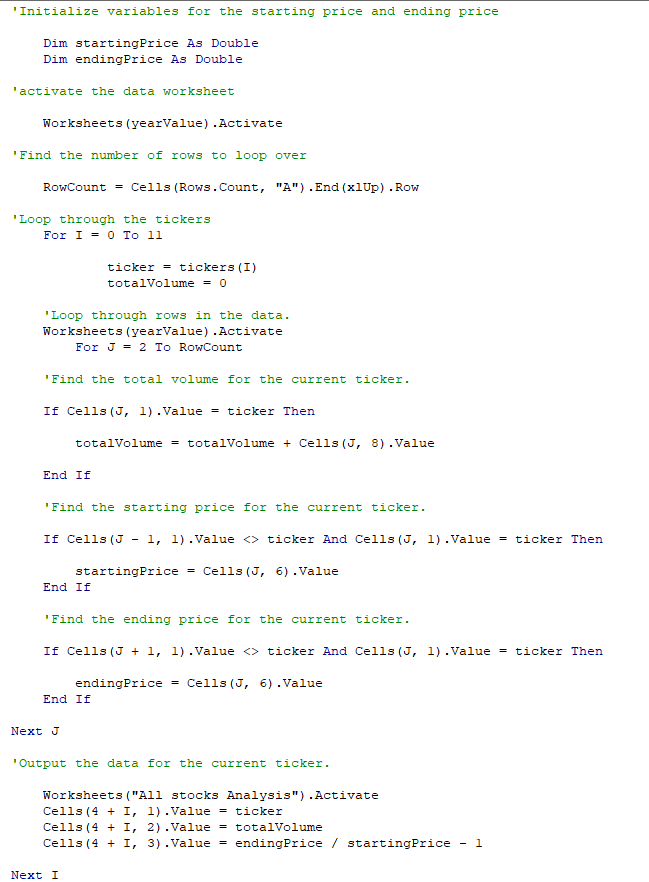
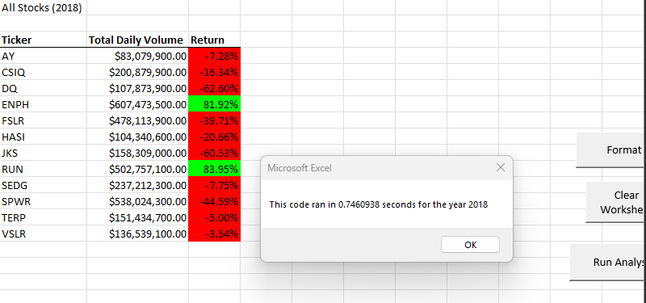
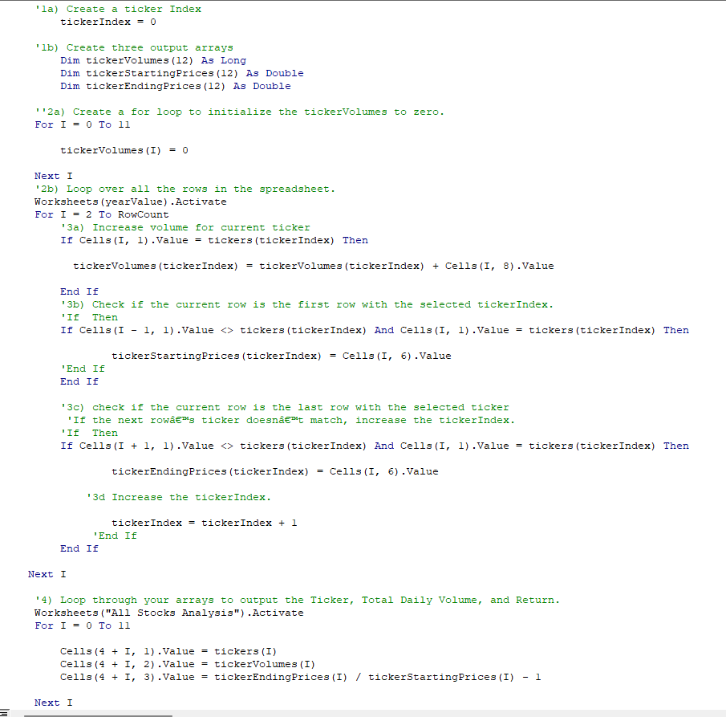
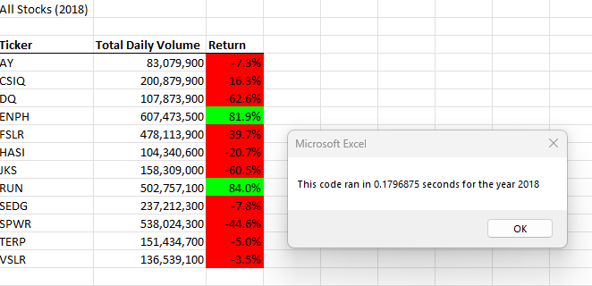

# stock-analysis

## Overview of Project
This project was to refactor the code given to us to loop through all the data one time in order to collect the same information that we got in the module homework. We compared the run time of the 2018 stock analysis we did in our homework, to the run time of the same 2018 stock analysis, but with the refactored code. 

### Purpose
The purpose of the project is to refactor the code so it runs faster. The reason we want it to run faster is because if we had a giant data set, the code we did in our homework would take a while to execute. The code we refactored in our challenge will run through all the data much faster.

## Results

### Module 2 Homework Results
The code between the homework and the challenge look really similar in most instances. One difference is in the module 2 homework, we used two different factors I and J. 

.

With the code ran like this it took 0.7460938 seconds which is over twice as long as it took the refactored code.

.

### Challenge 2 Refactored Code Results
For the refactored code, although it looks very similar to the homework code, we didn't use J, we used one factor (I) throughout, which I believe is what sped things up.

With the code ran like this it took 0.1796875 seconds to run. 

.

## Summary
The advantages of of refactoring code is that there is almost always a cleaner and faster way to write and run code. By doing this, we were able to cut the run time in  half. The only disadvantage of this I would say is the amount of time it takes to figure out how to refactor it a better way. It could be simply because I don't have much experience, but it took several hours of research and trying different ways to get it to work. Most of the time, it is just a simple letter or word I have wrote wrong that can stump me for hours.   These pros and cons apply to refactoring the original VBA script because although it wasn't an easy task, and took alot of time and effort, I was able to clean up the code and make the script run faster. 
